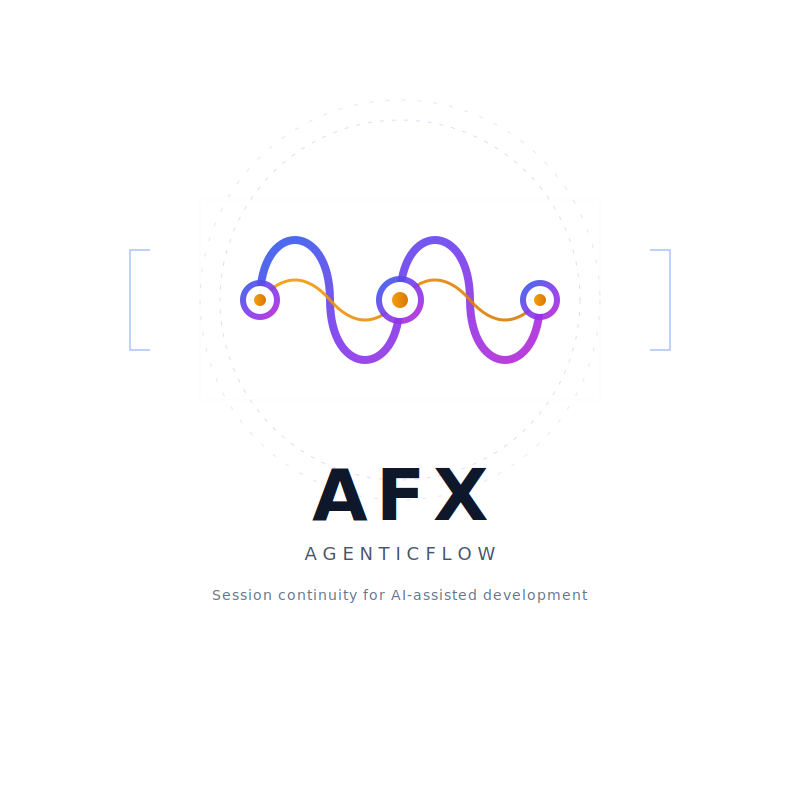
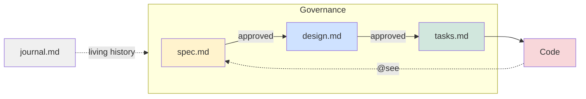
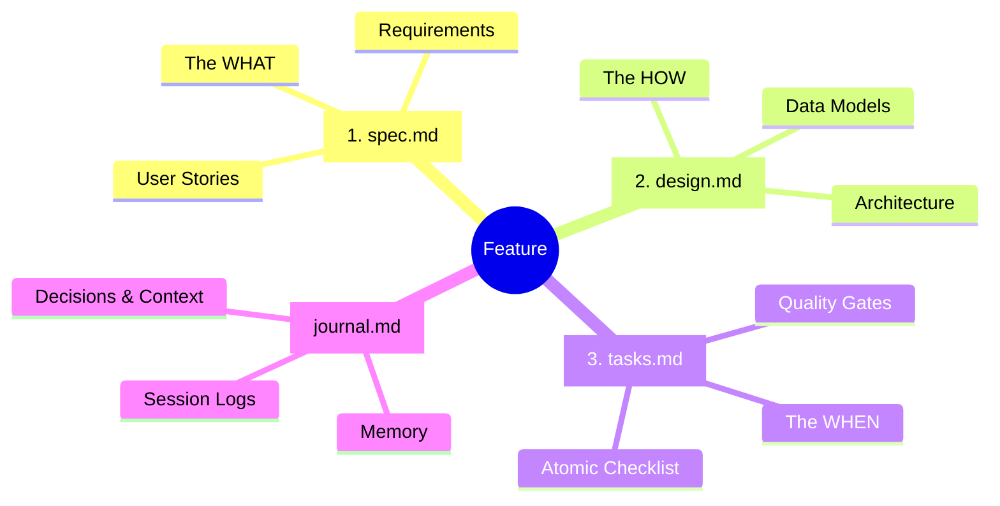
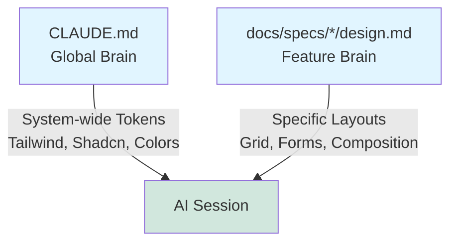

<p align="center">
  
  <br/><br/>
  <a href="https://marketplace.visualstudio.com/items?itemName=AgenticFlowX.agenticflowx"></a>
  <br/>
  <sub>The spec-driven AI coding environment — now on the <a href="https://marketplace.visualstudio.com/items?itemName=AgenticFlowX.agenticflowx">Marketplace</a> · <a href="https://agenticflowx.github.io/">Website</a> · <a href="https://github.com/AgenticFlowX/agenticflowx">GitHub</a></sub>
  <br/><br/>
  <strong>Works with</strong>
  <br/><br/>
  <a href="https://docs.anthropic.com/en/docs/claude-code"></a>
  <a href="https://platform.openai.com/docs/guides/codex"></a>
  <a href="https://cloud.google.com/products/gemini/code-assist"></a>
  <a href="https://docs.github.com/en/copilot"></a>
</p>

---

# AFX (AgenticFlowX)

> **Pause. Think. Plan. Ship.**

AFX is a **spec-driven development framework** for AI coding assistants — Claude Code, Codex, Gemini CLI, and GitHub Copilot. It keeps AI agents aligned with what you actually want to build, across sessions, across agents, across time.

**[Quick Start](docs/agenticflowx/quickstart.md) · [Why AFX](docs/agenticflowx/why-afx.md) · [Is AFX for me?](docs/agenticflowx/is-afx-for-me.md) · [Full Docs](docs/agenticflowx/agenticflowx.md)**



## Why AFX

**Session continuous.** Close your laptop without losing context. Any agent — human or AI — resumes exactly where the last one left off.

- `journal.md` — append-only record of every decision and discussion
- `/afx-context save/load` — bundles spec state, task progress, and open questions for instant handoff

**Bidirectionally traceable.** Every line of code links back to the requirement that justified it.

- Every function carries a `@see` link to the spec and design section it implements
- No orphaned code. No ghost requirements. The spec stays the single source of truth

**Living specs as governance.** `spec.md` and `design.md` are not write-once artifacts — they are always current.

- Always represent the _current factual state_ of the system, written in the present tense
- Updated in place when scope changes; historical context lives in `journal.md`

**Sprint mode for fast work.** Start a feature in minutes, not hours of setup.

- `/afx-sprint` — spec + design + tasks in one document with per-section approval gates
- Graduate to four files when scope grows: `/afx-sprint graduate`

**Prompt fidelity.** Capture the exact conversation that changed the spec, not just the outcome.

- `/afx-session capture` — stores the verbatim prompt that triggered a spec change or design pivot
- Includes agent identity, trigger classification, and affected anchors — so future agents know _why_, not just _what_

## Quick Start

> **OS Support**: Tested on macOS and Linux/WSL. Windows users: use **Git Bash** — tested and working.

```bash
# From your project directory
curl -sL https://raw.githubusercontent.com/AgenticFlowX/afx/main/afx-cli | bash -s -- .
```

Or if you have AFX cloned locally:

```bash
./path/to/afx/afx-cli /path/to/your/project
```

The installer prompts for your AI agents, then sets up skills, config, docs, and directory structure. **New to AFX?** Follow [quickstart.md](docs/agenticflowx/quickstart.md) to scaffold your first spec and pick your first task in under 5 minutes.

## What's actually in the box?

AFX isn't just a script you run; it's made up of three parts that work together:

1. **The Workflow**: The actual rules and methodology. This is the "pause, think, plan" philosophy, the commands you use, and the verification steps that keep your project from turning into a mess.
2. **The Skills (`skills/`)**: These are the literal prompt instructions we feed to Claude, Codex, or Copilot. They follow the open [agentskills.io](https://agentskills.io) standard format, teaching your AI assistant how to follow the workflow, what commands like `/afx-next` do, and how to format their output.
3. **The Templates**: The physical markdown files (`spec.md`, `design.md`, etc.) that hold your project's rules and history.

> **Agent Compatibility**: Skills follow the open [agentskills.io](https://agentskills.io) standard. Tested and verified tools:

| Agent              | Status            | Notes                           |
| :----------------- | :---------------- | :------------------------------ |
| **Claude Code**    | ✅ Heavily tested | Primary development environment |
| **GitHub Codex**   | ✅ Tested         | Several validation runs         |
| **GitHub Copilot** | ✅ Tested         | Via `.github/prompts/`          |
| **Gemini CLI**     | ✅ Tested         | Via `.gemini/commands/`         |
| **Cline**          | ⚠️ Untested       | May work, not verified          |
| **AugmentCode**    | ⚠️ Untested       | May work, not verified          |
| **KiloCode**       | ⚠️ Untested       | May work, not verified          |
| **OpenCode**       | ⚠️ Untested       | May work, not verified          |

Let's look at those templates.

## The Four-File Structure

Every feature gets four files. **The sequence is mandatory** — you cannot start design until spec is approved, and you cannot open tasks until design is approved:

```
1. spec.md   → define WHAT to build (get human approval)
2. design.md → define HOW to build it (get human approval)
3. tasks.md  → define WHEN / atomic checklist (then implement)
4. journal.md → append-only log of decisions (every session)
```



- **`spec.md`**: Requirements only. No implementation details. `[FR-X]` and `[NFR-X]` IDs are stable anchors that code links back to. Always reflects the _current factual state_ — updated in place when scope changes, versioned and re-approved when it does.

  <details>
  <summary>View spec.md example</summary>

  ```markdown
  ---
  afx: true
  type: SPEC
  status: Draft
  owner: "@rix"
  version: "1.0"
  created_at: "2025-10-20T10:00:00.000Z"
  updated_at: "2025-10-20T10:00:00.000Z"
  tags: ["user-management"]
  ---

  # User Management - Product Specification

  ## Functional Requirements

  | ID   | Requirement                                       | Priority  |
  | ---- | ------------------------------------------------- | --------- |
  | FR-1 | Paginated, sortable list of all users.            | Must Have |
  | FR-2 | Filter by Role, Status, and Verification Context. | Must Have |

  ## Non-Functional Requirements

  | ID    | Requirement | Target              |
  | ----- | ----------- | ------------------- |
  | NFR-1 | Performance | Page load < 2s      |
  | NFR-2 | Security    | Auth on all actions |
  ```

  </details>

- **`design.md`**: Technical architecture. How you'll implement the spec. Every `##` heading has a `[DES-ID]` Node ID. Like `spec.md`, it is a living document — always the current factual state of the architecture, not a snapshot from the day it was written. Can include data models, API contracts, UI mockups, flows — whatever the agent needs to implement correctly.

  <details>
  <summary>View design.md example</summary>

  ````markdown
  ---
  afx: true
  type: DESIGN
  status: Draft
  owner: "@rix"
  version: "1.0"
  created_at: "2025-10-21T09:00:00.000Z"
  updated_at: "2025-10-21T09:00:00.000Z"
  tags: ["user-management"]
  spec: spec.md
  ---

  # User Management - Technical Design

  ## [DES-UI] UI Layout

  <!-- @see spec.md [FR-1] [FR-2] -->

  ```
  ┌─────────────────────────────────────────────────┐
  │  Users                              [+ Add User] │
  │─────────────────────────────────────────────────│
  │  Search: [____________]  Role: [All ▼]           │
  │─────────────────────────────────────────────────│
  │  Name          Role      Status    Actions       │
  │  John Doe      Admin     Active    [Edit][Delete]│
  │  Jane Smith    Member    Pending   [Edit][Delete]│
  │─────────────────────────────────────────────────│
  │  < 1 2 3 >                          10 / page ▼  │
  └─────────────────────────────────────────────────┘
  ```

  ## [DES-FLOW] Auth Flow

  ```
  Client → POST /api/users/create
    → validatePermissions(CASL) → 403 if denied
    → validateSchema(Zod)       → 400 if invalid
    → db.insert(users)          → 500 if fails
    → return { id, role }       → 201 Created
  ```

  ## [DES-DATA] Data Model

  | Column       | Type      | Description       |
  | ------------ | --------- | ----------------- |
  | `id`         | UUID      | Primary Key       |
  | `role`       | String    | admin \| member   |
  | `status`     | String    | active \| pending |
  | `created_at` | Timestamp | ISO 8601          |

  ## [DES-COMP] Component

  <!-- @see spec.md [FR-1] -->

  ```tsx
  export function UsersTable({ users, onEdit, onDelete }: UsersTableProps) {
    return (
      <Table>
        <TableHeader>
          <TableRow>
            <TableHead>Name</TableHead>
            <TableHead>Role</TableHead>
            <TableHead>Status</TableHead>
            <TableHead>Actions</TableHead>
          </TableRow>
        </TableHeader>
        <TableBody>
          {users.map((user) => (
            <UserRow key={user.id} user={user} onEdit={onEdit} onDelete={onDelete} />
          ))}
        </TableBody>
      </Table>
    );
  }
  ```
  ````

  </details>

- **`tasks.md`**: Implementation checklist. Structured using dot-notation derived from traditional **Work Breakdown Structures (WBS)**. Requires two-stage verification (Agent + Human) before a phase is closed.

  ```markdown
  ---
  afx: true
  type: TASKS
  status: Draft
  owner: "@rix"
  version: "1.0"
  created_at: "2025-10-22T08:00:00.000Z"
  updated_at: "2025-10-22T08:00:00.000Z"
  tags: ["user-management"]
  spec: spec.md
  design: design.md
  ---

  # User Management - Implementation Tasks

  ## Phase 1: Data Layer

  - [ ] 1.1 Add User model to schema and run migrations
  - [ ] 1.2 Implement repository interface and adapter

  ## Phase 2: Frontend UI

  - [ ] 2.1 Build `<UsersTable />` with Tailwind styling
  - [ ] 2.2 Wire table to server action with Zod validation

  ## Work Sessions

  | Date | Task | Action | Files Modified | Agent | Human |
  | ---- | ---- | ------ | -------------- | ----- | ----- |
  ```

- **`journal.md`**: Append-only historical log of all discussions and decisions.

  ```markdown
  ---
  afx: true
  type: JOURNAL
  status: Living
  owner: "@rix"
  created_at: "2025-10-20T10:00:00.000Z"
  updated_at: "2025-10-24T14:00:00.000Z"
  tags: ["user-management"]
  ---

  # Journal - User Management

  <!-- prefix: UM -->

  ## Captures

  ## Discussions

  ### UM-D001 - Schema decision

  `created:2025-10-24`

  Chose `uuid` over autoincrement integer for `id` to prevent enumeration.
  API route `/api/users` completed. Next agent should wire frontend table.
  ```

- **`research/`**: (Auxiliary) Dedicated space for feature-local decision records (ADRs).

**Traceability in action**: When the agent writes code, every major function gets a `@see` backlink to the spec or task that required it. This is how AFX eliminates orphaned code.

```typescript
// ✅ AFX-compliant: every function is traceable back to its requirement

/**
 * @see docs/specs/user-auth/spec.md [FR-1]
 * @see docs/specs/user-auth/design.md [DES-AUTH]
 */
export async function generateVerificationToken(email: string): Promise<string> {
  // Implementation...
}

/**
 * @see docs/specs/user-auth/spec.md [FR-2]
 * @see docs/specs/user-auth/design.md [DES-API]
 */
export async function signInWithEmail(data: SignInSchema) {
  // Implementation...
}
```

> **Looking for the full templates or a working example?**
>
> 1. Templates are bundled inside each skill's `assets/` directory (e.g., `skills/agenticflowx/afx-spec/assets/spec-template.md`) for the exact YAML frontmatter and document structures expected by AFX coding agents.
> 2. Explore the [`examples/minimal-project/`](examples/minimal-project/) directory to see how a complete AFX continuous-development environment is structured in practice.

## Global Context vs Local Context

AFX prevents AI context window bloat and conflicting instructions by separating global rules from local rules.



<details>
<summary><strong>Commands reference</strong></summary>

### Context & Navigation

**`/afx-next`** - Context-aware guidance
Analyzes your project state and tells you exactly what to work on next. Checks for unapproved specs, incomplete tasks, pending verifications, and stale sessions.

**`/afx-discover [capabilities|scripts|tools|project]`** - Project intelligence
Scans your codebase to understand build systems, test runners, package managers, and available tooling. Claude learns how to build, test, and deploy your project.

**`/afx-spec validate|discuss|review|approve`** - Specification management (owns `spec.md`)

**`/afx-design author|validate|review|approve`** - Technical design authoring, validation, and approval

### Development

**`/afx-task plan|pick|code|verify|complete|sync`** - Implementation lifecycle — plan, pick, code, verify, complete, sync

**`/afx-dev debug|refactor|review|test|optimize`** - Advanced diagnostics — debug, refactor, review, test, optimize

**`/afx-scaffold spec|research|adr <name>`** - Scaffold new work

**`/afx-adr create|review|list|supersede`** - ADR management

### Verification

**`/afx-check path|trace|links|deps|coverage`** - Quality gates

- `path` - **BLOCKING GATE**: Trace execution from UI → business logic → database
- `trace` - Verify all code has valid `@see` annotations
- `links` - Check spec integrity and cross-references
- `deps` - Check dependency health and compatibility
- `coverage` - Measure spec-to-code coverage

**`/afx-hello`** - Environment diagnostics and installation verification

### Session Management

**`/afx-session note|log|recap|promote|capture`** - Discussion capture and context preservation

**`/afx-context save|load`** - Context transitions
Package current context for transfer to another agent or future session. Includes spec state, task progress, verification status, and discussion history.

### Reporting

**`/afx-report orphans|coverage|stale`** - Traceability metrics and project health

</details>

## Example Workflow

```
afx-spec create → afx-spec approve → afx-design author → afx-design approve
  → afx-task plan → afx-task pick → afx-task code → afx-check path → afx-task complete
                          ↑                                                |
                          └────────── afx-next (resume next session) ──────┘
```

> **Faster start?** `/afx-sprint new <feature>` collapses the entire flow into a single document with per-section approval gates. Same discipline — graduate to four files when scope demands it.

## Quick Start

### One-Line Install

> **Note on OS Support**: The AFX CLI and commands are heavily tested on macOS and Unix-like systems (Linux/WSL). They have not been formally tested on native Windows.

```bash
# From your project directory
curl -sL https://raw.githubusercontent.com/AgenticFlowX/afx/main/afx-cli | bash -s -- .
```

Or if you have AFX cloned locally:

```bash
./path/to/afx/afx-cli /path/to/your/project
```

The installer prompts you to select which AI agents you use, then installs:

- AFX skills to selected skill targets (`.claude/skills/` and/or `.agents/skills/`), including templates bundled in skill `assets/` directories
- Configuration file `.afx.yaml`
- AFX documentation to `docs/agenticflowx/`
- Context files for selected agents (`CLAUDE.md`, `AGENTS.md`, and optionally `GEMINI.md`)
- Directory structure: `docs/specs/` and `docs/adr/`

## First time?

See **[quickstart.md](docs/agenticflowx/quickstart.md)** — install, scaffold your first spec with `/afx-spec create`, and pick your first task in under 5 minutes.

## Reality Check: Working with LLMs

> **Important caveat**: The skills driving these AFX commands are still a work in progress and are rapidly evolving.

From extensive experience, we know that LLMs (like Claude, Codex, and others) can sometimes "drift" or hallucinate, even when provided with heavy instructions and stringent AFX guidelines. There will inevitably be times when tools and commands do not execute exactly as expected.

As a user, you should anticipate a hybrid workflow. You will often need to use a mix of strict AFX slash commands (e.g., `/afx-spec review`) combined with your own **on-the-fly custom prompting** to course-correct the agent when it loses context or drifts from the instructions. AFX provides the crucial rails, but you are still the driver.

---

## Standards & References

AFX's template system is a pragmatic hybrid of established industry standards:

- [IEEE 830 / ISO/IEC/IEEE 29148](https://standards.ieee.org/ieee/29148/6937/) -- Software Requirements Specification structure, adapted for agile feature-level specs
- [MoSCoW (Dai Clegg, 1994 / DSDM)](https://en.wikipedia.org/wiki/MoSCoW_method) -- Requirement prioritization: Must Have / Should Have / Could Have / Won't Have
- [User Stories (Mike Cohn / XP)](https://www.mountaingoatsoftware.com/agile/user-stories) -- Connextra format: "As a [role], I want [feature], So that [benefit]"
- [C4 Model (Simon Brown)](https://c4model.com/) -- Software architecture diagram levels (Context, Container, Component, Code)
- [ADR (Michael Nygard, 2011)](https://cognitect.com/blog/2011/11/15/documenting-architecture-decisions) -- Architecture Decision Records: Context, Decision, Consequences
- [WBS (PMI PMBOK Guide)](https://en.wikipedia.org/wiki/Work_breakdown_structure) -- Work Breakdown Structure for hierarchical task decomposition
- [Traceability Matrix (IEEE 29148 / DO-178C)](https://standards.ieee.org/ieee/29148/6937/) -- Cross-reference mapping from Requirements to Design to Code

---

## Contributing

Contributions are welcome! Please read [CONTRIBUTING.md](CONTRIBUTING.md) before submitting PRs.

## License

MIT License - see [LICENSE](LICENSE) for details.

## Acknowledgments

AFX was developed as part of real-world production projects and refined through extensive use with Claude Code, Codex, Gemini CLI, and GitHub Copilot.
