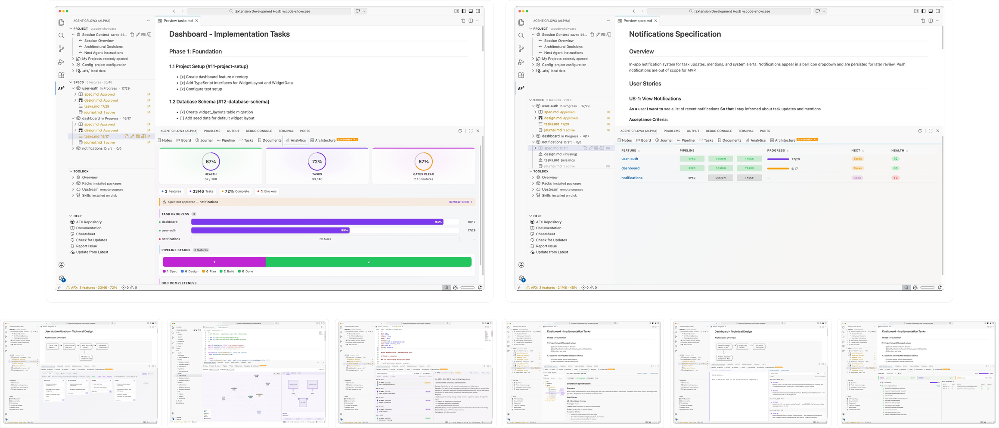
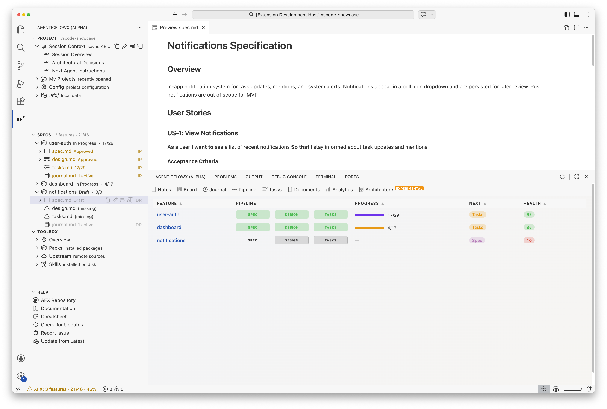
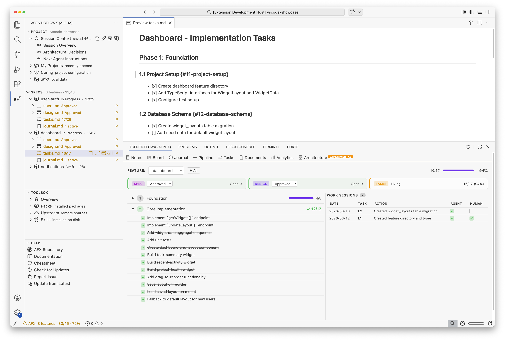
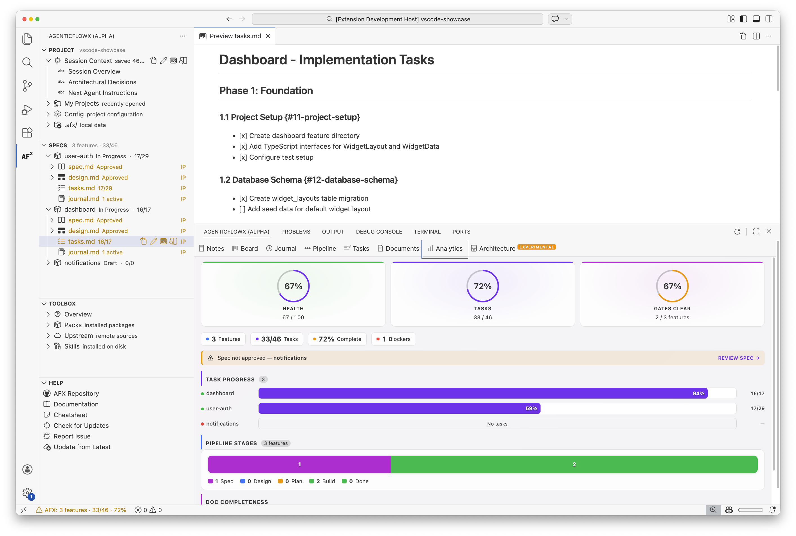
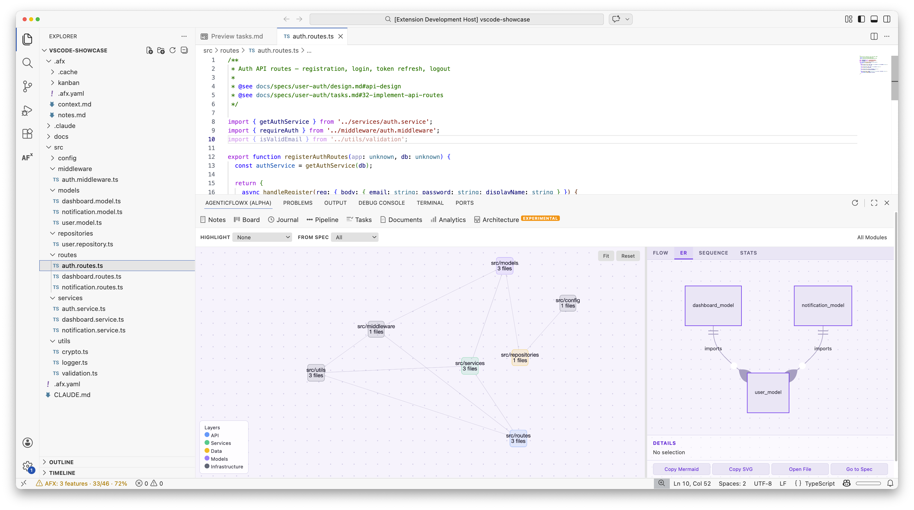
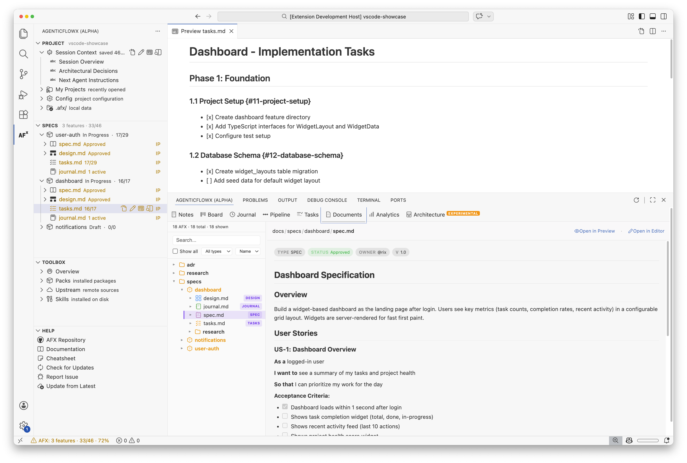
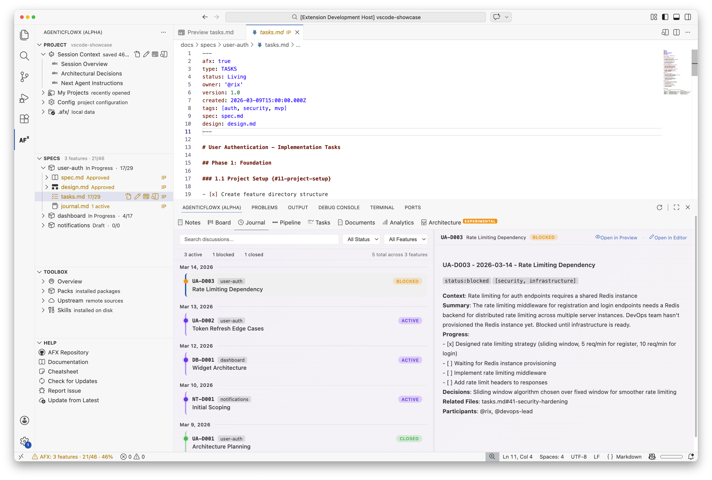
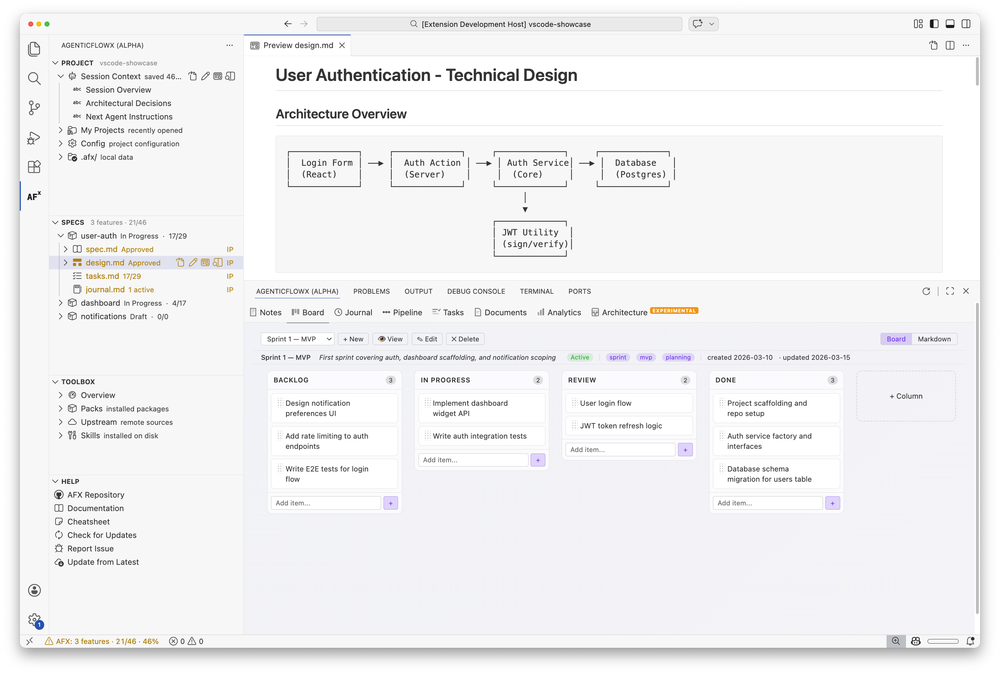
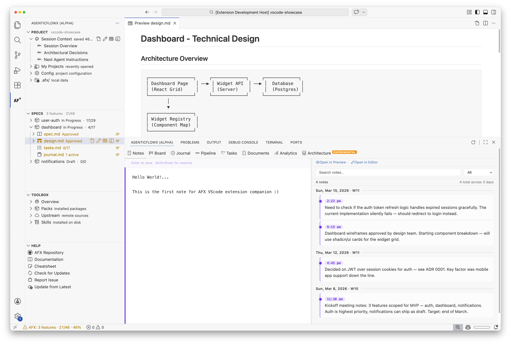

# AFX — VSCode Extension

The **AgenticFlowX (AFX) VSCode Extension** is a dedicated graphical interface designed to bring the AFX lifecycle into focus. It provides a visual layer on top of the spec-driven workflow, allowing you to audit tasks, navigate specifications, and manage skill packs directly in the editor.

> [!IMPORTANT]
> **Companion, Not a Replacement** — This extension is a visual *companion* to the AFX workflow. It is **not** a replacement for AI agents like Claude Code, Codex, or Copilot. You still use your preferred agent to execute the work; the extension simply provides the "bird's-eye view" and GUI controls for the process.

> [!WARNING]
> **Alpha Status** — This extension is in early development. Expect bugs; some features may be unstable or non-functional. Not yet available on the VS Code Marketplace.

---

## The GUI for the AFX Lifecycle

The extension surfaces the critical "bird's-eye view" of your project through two main UI surfaces: a **Sidebar** for navigation and a **Bottom Panel** for deep-dive status and tools.

### 1. The Activity Bar Sidebar
The sidebar contains 5 specialized views to manage your workspace:

- **Project**: Browse your saved session context (`.afx/context.md`), configuration (`.afx.yaml`), and the local `.afx/` directory.
- **Specs**: A hierarchical tree of all features grouped by status (In Progress, Draft, Approved, Complete). Quickly navigate to specific spec sections or copy `@see` traceability references.
- **Library**: Browse ADRs (Architecture Decision Records) and features tagged in their frontmatter.
- **Toolbox**: Manage your AFX skill packs without touching the terminal. Install, enable, disable, or remove packs—operations delegate directly to `afx-cli`.
- **Help**: Quick-access hub for documentation, cheatsheets, and support.

---

### 2. The Multi-Tab Bottom Panel
The bottom panel sits alongside your Terminal and provides 8 essential views into your project:

#### 📊 Pipeline & Tasks
The heart of AFX tracking.
- **Pipeline**: A matrix view showing where every feature stands across the Spec → Design → Tasks gates. Include health scores and recommended next actions.
- **Tasks**: Feature-scoped breakdown with an accordion of phases. Includes work session history to see exactly what was done by whom and when.

#### 📝 Project Intelligence
- **Analytics**: A KPI dashboard for project health, including a four-stage pipeline gauge and task completion histograms.
- **Architecture**: Dual-pane dependency analysis with an interactive Cytoscape.js graph and cycle detection.

#### 🗂 Documentation & Journaling
- **Documents**: Master-detail explorer for everything in `docs/`. Preview markdown and images effortlessly.
- **Journal**: A consolidated timeline of discussions pulled from all `journal.md` files across your features.

#### ⚡️ Productivity Tools
- **Board**: A YAML-backed Kanban board for general task tracking within your editor.
- **Notes**: A fast scratchpad for fleeting notes with a date-sorted markdown timeline.

---

## Key Capabilities

| Capability | Description |
| :--- | :--- |
| **Traceability** | Click phase children in the Specs tree to jump to the exact line in code or spec files. |
| **Pack Management** | Install new AFX capabilities (e.g., `afx-pack-qa`) with one click in the Toolbox. |
| **Session Continuity** | View the current active features and their saved context directly in the Project view. |
| **Health Monitoring** | Track "drift" and project health via the Analytics dashboard. |

---

## Installation (Alpha)

Currently, the extension is installed via VSIX from the [GitHub Releases](https://github.com/rixrix/afx/releases) page.

1. Download the latest `.vsix` file.
2. In VSCode, open the Extensions panel (`Cmd+Shift+X`).
3. Click the `...` menu and select **Install from VSIX...**.
4. Select the downloaded file.

---

## Part of the Ecosystem

The extension works in tandem with the core framework:
- **`afx-cli`**: The engine for installation and pack management.
- **[agenticflowx.md](agenticflowx.md)**: The underlying spec-driven workflow methodology.
- **[packs-and-skills.md](packs-and-skills.md)**: The reference for the skills that power the CLI and Extension alike.
