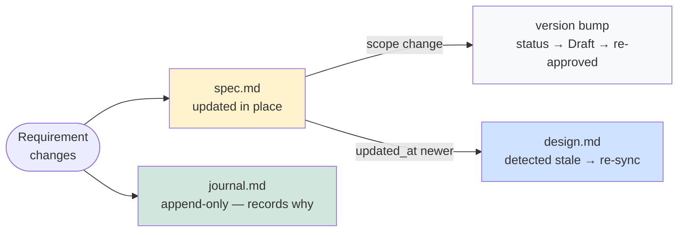

# Why AFX

AFX is a spec-driven development framework for AI-assisted software projects. It is not a code generator. It is a **deliberate workflow** that keeps AI agents aligned with what you actually want to build — across sessions, across agents, across time.

---

## The problem AFX solves

AI coding assistants are fast. They are also amnesiac, scope-creeping, and optimistic about completion. Left unguided:

- **Context amnesia**: close a terminal, lose all context. The next agent starts from scratch.
- **Scope creep**: fix a bug, the agent refactors everything around it.
- **Orphaned code**: functions appear with no clear link to any requirement.
- **Hallucinated completion**: tasks are marked done, the path is never actually tested.

AFX imposes structure that prevents these failure modes without slowing you down.

---

## Five pillars

### 1. Session continuity

Every decision, discussion, and pivot is recorded in `journal.md` — append-only, never rewritten. `/afx-context save` packages the current mental state (spec progress, task status, open questions) so any agent — human or AI — can pick up exactly where the last one left off.

```bash
# End of Monday's session
/afx-context save user-auth
# → bundles: spec approved, task 2.3 in-progress, 2 open questions

# Tuesday — new session, same agent or different
/afx-context load
# → resumes at task 2.3 with full context, no re-reading required
```

> Tuesday's agent resumes Monday's work without re-reading the entire codebase.

### 2. Bidirectional traceability

Every function carries a `@see` link back to the spec requirement it implements. Every requirement is anchored with a stable ID (`FR-1`, `DES-API`). The VSCode extension surfaces orphaned code and ghost requirements in the Problems panel.

```typescript
/**
 * @see docs/specs/user-auth/spec.md [FR-1]
 * @see docs/specs/user-auth/design.md [DES-AUTH]
 */
export async function generateToken(email: string): Promise<string> {
  // agent wrote this — the @see proves it was spec-driven, not invented
}
```

> No orphaned code. No ghost requirements. The spec is always the single source of truth.

### 3. Living specs as governance

`spec.md` and `design.md` are **living documents** — always written in the present tense, always representing the _current factual state_ of the system. Historical backstory, abandoned ideas, and chronological narratives belong in `journal.md`, not the spec.

They are versioned and timestamped. Once a feature is implemented, the spec is stable — it becomes the authoritative record for that version. But when a fix lands or a new feature extends the scope, the spec updates in place. No delta files stacked on top of a frozen baseline. No separate amendment documents. The spec and design always read as current law.

The journal carries the history. When something changes, the journal records what changed, why, and which prompt or discussion triggered it. The spec stays clean and readable. The history stays complete.



This also means:

- **No delta layer needed** — the spec updates in place; the journal is the delta trail
- **No constitution ceremony** — `spec.md` + ADRs already encode the project's law; there's no separate founding document to maintain

> The spec is not a snapshot from day one. It is a living record — stable when implemented, updated when reality changes, always written in the present.

### 4. Sprint mode for fast work

`/afx-sprint` collapses spec + design + tasks into a single document with per-section approval gates. Same SDD discipline, a fraction of the ceremony. When a feature outgrows the single doc, `/afx-sprint graduate` splits it into four files automatically.

```bash
/afx-sprint new payment-flow       # single doc: spec + design + tasks
/afx-sprint spec payment-flow --approve
/afx-sprint design payment-flow --approve
/afx-sprint code payment-flow      # delegates to /afx-task code

/afx-sprint graduate payment-flow  # splits into 4 files when scope grows
```

> Start lean. Graduate when scope demands it.

### 5. Prompt fidelity

`/afx-session capture` stores the verbatim user prompt that triggered a spec change, design pivot, or missed requirement — alongside the agent's reply excerpt, the trigger classification, and the agent and model identity. Future agents trace _why_ each requirement exists, not just _what_ it says.

```markdown
### UA-P001 — Missed requirement: account lockout

- trigger: missed-req | agent: claude-code | model: claude-opus-4-7
- triggered-change: FR-4, [DES-RATE-LIMIT]

**User prompt**: What about rate limiting on failed login attempts?
We had a credential stuffing incident last quarter.

**Agent reply**: Adding FR-4: account lockout after 5 failed attempts
with 15-min cooldown. Wiring a [DES-RATE-LIMIT] section to design.

**Outcome**: spec.md FR-4 added · design.md [DES-RATE-LIMIT] added
```

> The institutional knowledge that normally lives only in someone's memory is now written down.

---

## What AFX is not

- **Not a code generator**: AFX does not generate code from specs. It ensures the code that gets written links back to specs.
- **Not a heavy process**: six daily-use commands cover 90% of the workflow. Sprint mode reduces that further.
- **Not AI-only**: the two-stage gate (Agent `[x]` + Human `[x]`) keeps a human in the loop at every task boundary.
- **Not locked to one agent**: works with Claude Code, Codex, Gemini CLI, GitHub Copilot, and others.

---

## The IDE layer

AFX ships as a portable workflow (markdown skills + CLI installer) that any editor can adopt. It also ships as a dedicated **VSCode extension** that makes the five pillars tangible:

- **CodeLens + Problems panel** — orphan code and ghost requirements surface where engineers already look
- **Spec injection** — active spec, next task, and prior decisions auto-injected into every agent prompt
- **Focus Track** — select a spec; the extension loads the right skill automatically
- **Right-click dispatch** — send a task to Claude Code, Copilot, Codex, or Gemini from `tasks.md`
- **7-tab bottom panel** — Pipeline, Workbench, Board, Journal, Documents, Notes, Analytics

---

## When AFX works best

- Long-running features (days or weeks, not hours)
- Multi-session or multi-agent work where context handoffs matter
- Projects where spec and code must stay in sync over time
- Teams that need a governance trail without a heavyweight process

Not sure if AFX fits your situation? See [is-afx-for-me.md](is-afx-for-me.md).
